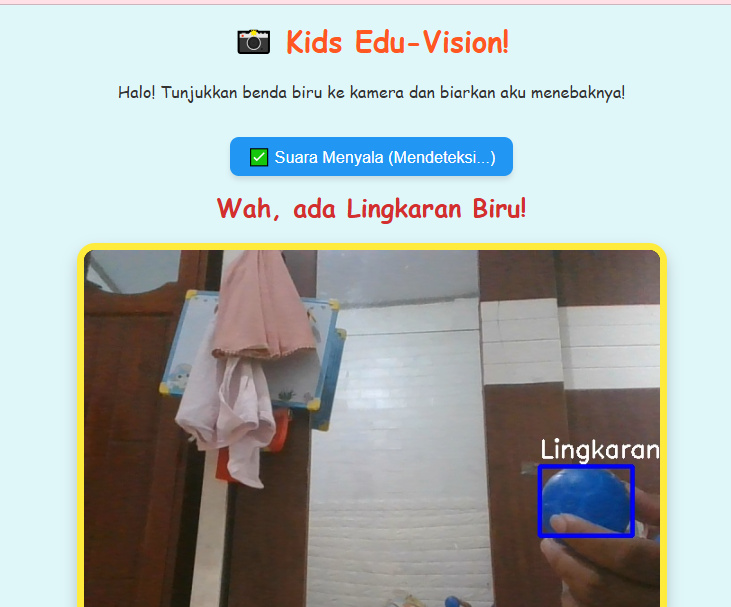

# 🌈 Kids Edu-Vision: Web-Based Smart Learning



Aplikasi web interaktif berbasis AI yang dirancang untuk membantu anak-anak mengenal bentuk geometris dan warna melalui kamera browser. Proyek ini menggabungkan **Backend Python** yang kuat untuk pemrosesan citra dan **Frontend Web** yang ceria untuk pengalaman belajar yang interaktif.

## 📌 Deskripsi Proyek
Kids Edu-Vision hadir sebagai solusi alat peraga digital yang mudah diakses. Dengan memanfaatkan teknologi *Computer Vision*, aplikasi ini dapat mendeteksi objek secara real-time, mengidentifikasi warna, dan memberikan umpan balik berupa suara otomatis. Fokus utama proyek ini adalah menciptakan antarmuka (UI) yang ramah anak dan aksesibilitas tanpa perlu instalasi aplikasi tambahan.

## 🚀 Fitur Utama
- **Real-time Web Detection:** Akses kamera langsung dari browser untuk deteksi objek seketika.
- **Color & Shape Recognition:** Klasifikasi bentuk (lingkaran, kotak, segitiga) dan analisis warna dominan menggunakan OpenCV.
- **Voice Feedback:** Menggunakan *Web Speech API* untuk memberikan respons suara natural.
- **Responsive Kid-Friendly UI:** Desain antarmuka yang cerah, tombol besar, dan navigasi yang mudah bagi anak-anak.

## 🛠 Tech Stack
- **Backend:** Python (Flask) + OpenCV + Numpy
- **Frontend:** HTML5, CSS3, JavaScript
- **API Suara:** Web Speech API (Browser Native)

## 📂 Struktur Repositori
```text
├── backend/
│   └── app.py              # Server Backend (Flask) & Logika OpenCV
├── frontend/
│   ├── index.html          # Halaman utama Web
│   └── static/             # (Opsional) File CSS/JS tambahan
├── requirements.txt        # Daftar library Python
├── demo.jpg                # Screenshot aplikasi
└── README.md               # Dokumentasi proyek